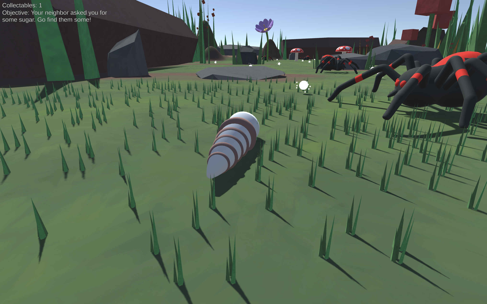
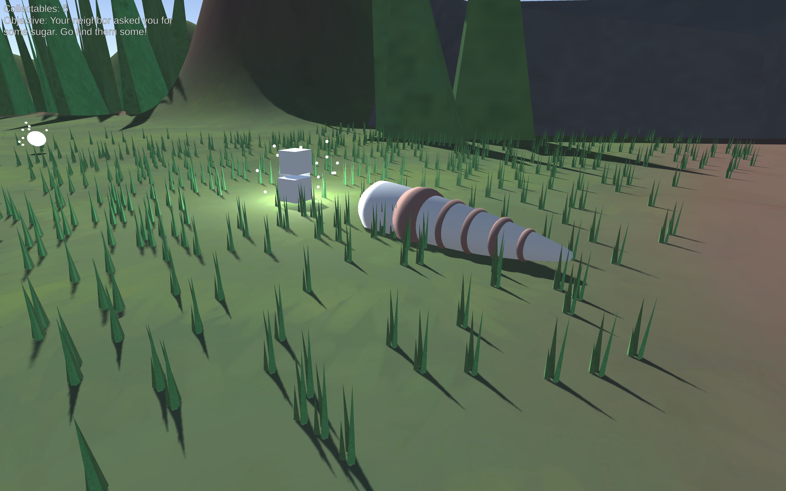

# The-Worm

_The Worm_ is an alt-controller style game developed with the Unity game engine. An alt-controller game bases its controls around a controller that is not in the typical format (e.g. an Xbox controller is a typical controller, where as a fight-stick could be considered an alt-controller.) For this game, we were given a homemade alt-controller composed of a record on a dowel rod, with a mouse placed under the record with the sensor pressed up against it. The controller basically acts as a steering wheel, with its functionality powered by the mouse's sensor.

This project is a prototype game created for my _Intermediate Game Design and Development_ class at IUPUI. My group, _Midwest Games_, was composed of five talented game designers who all made great contributions to this game. I worked as the group's programmer, developing the game's movement, enemy AI, pickups, and level events in C#. Other group contributers include:
- Level Designer - [Jacob Shultz](https://github.iu.edu/jfshultz)
- Artists - [Kelly Cutshall](https://github.iu.edu/kelcutsh) and [Nelick Marcos](https://github.iu.edu/nmarcos)
- Animator - [Joseph Girard](https://github.iu.edu/joegirar)

## Building and Playing the Game

The game can be built in the Unity Editor for either MacOS or Windows. The game was originally designed to be played with the alt-controller described above, where turning the record counter-clockwise would result in the worm moving forward and left and turning it clockwise would move the worm forward and right. Since the worm cannot move straight, you are supposed to "wiggle" the worm to move it. The same wiggle motion can be recreated by moving a mouse up and down.

The gameplay is very simple. Your neighbor (who is also a worm) has run out of sugar and has asked you for some. It turns out you also do not have any sugar, but you already told your neighbor you would get them some. Your goal is to wiggle your way to the other side of the map to pick up some sugar and then bring it back to your neighbor. Try not to get caught by any spiders, or you'll have to start over! See how many pickups you can collect along the way, too!

## Screenshots

